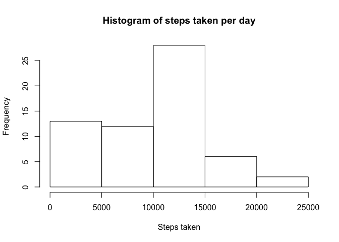
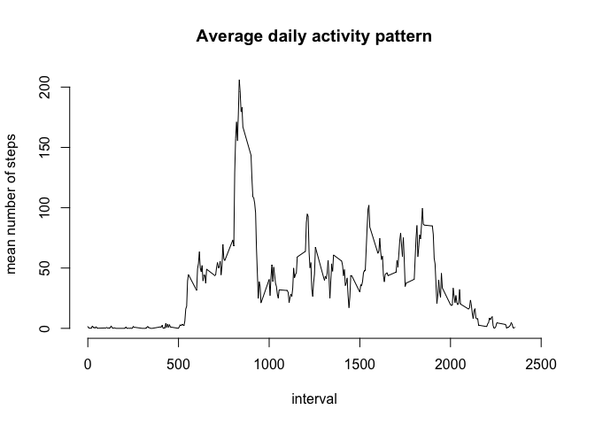
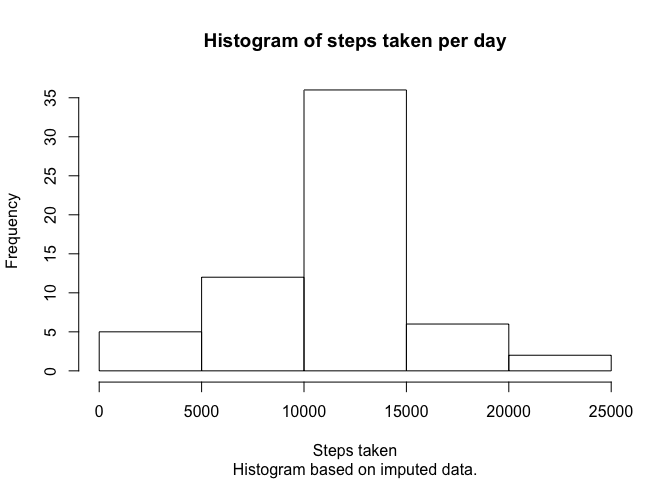
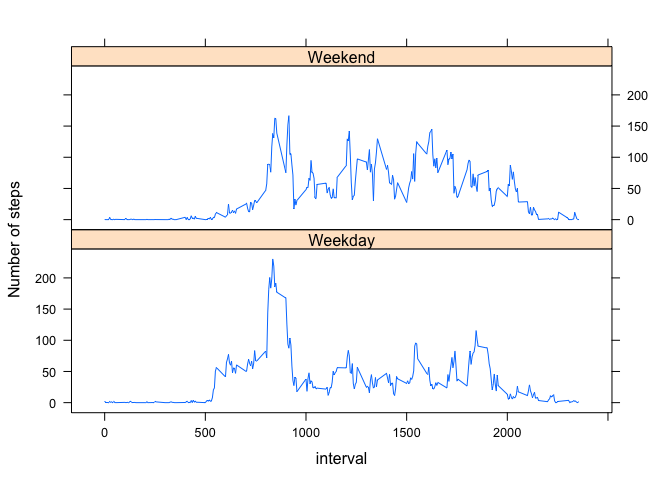

# Reproducible Research: Peer Assessment 1


## Loading and preprocessing the data

To prepare the data for analysis the first step is to unzip the data and read
the results into a dataframe. Then the date column is transformed to a 
POSIX date.


```r
activity <- read.csv(unz("activity.zip","activity.csv")
                     ,stringsAsFactors = FALSE)

activity$date <- as.Date(activity$date, "%Y-%m-%d")
```

## What is mean total number of steps taken per day?

The data are grouped by day and the sum of the number of steps is taken
per day. Any missing values are ignored. A histogram is made of the total number
steps per day.


```r
library(dplyr)
```

```
## 
## Attaching package: 'dplyr'
## 
## The following objects are masked from 'package:stats':
## 
##     filter, lag
## 
## The following objects are masked from 'package:base':
## 
##     intersect, setdiff, setequal, union
```

```r
activity.daily <- activity %>% 
                  group_by(date) %>% 
                  summarise(total_steps = sum(steps,na.rm=TRUE))

hist(activity.daily$total_steps,
     xlab="Steps taken",
     main="Histogram of steps taken per day"
     )
```

 

```r
mean_steps <- mean(activity.daily$total_steps)
median_steps <- median(activity.daily$total_steps)
```

The histogram shows that on the majority of days between 10000 and 15000 steps 
are taken.
There are also more days where fewer steps are taken, than days where more than
15000 steps are taken.

The mean steps taken per day is 9354.2295082. The median steps taken per day 
is 10395.


## What is the average daily activity pattern?

T show the average activity in a day over time all the original values are 
grouped by interval and then the mean number of steps per interval is 
calculated. Again, missing values are removed. The activity per interval is then
plotted.


```r
library(dplyr)

activity.interval <- activity %>% 
                  group_by(interval) %>% 
                  summarise(mean_steps = mean(steps,na.rm=TRUE))

plot(activity.interval$interval,
     activity.interval$mean_steps,
     type = "l",
     xlab= "interval",
     ylab="mean number of steps",
     main = "Average daily activity pattern",
     frame.plot = FALSE,
     xlim=c(0,2500)
     )
```

 

```r
max_steps_interval <- activity.interval[
    activity.interval$mean_steps == max(activity.interval$mean_steps),
    "interval"]
```

From the figure it is clear that, on average, most activity is undertaken 
between interval 500 and 2000. There is also a spike in activity between 
intervals 750 and 950.

The interval that, on average accross all days in the set, contains the 
maximum number of steps is the interval 835.

## Imputing missing values

In order to inverstigate the influence of the missing values, first the number
of missing values is calculated.


```r
na_vals <- sum(is.na(activity))
na_steps <- sum(is.na(activity$steps))
```

The number of missing values in the dataset is 2304.
The number of missing steps values in the dataset is 2304. 
This means there are only steps values missing. 
We can impute these values by assigning the average steps taken for the
corresponding interval to the missing steps taken value.


```r
activity.imputed <- merge(activity,activity.interval,by="interval")
activity.imputed <- mutate(activity.imputed,
       steps = ifelse(is.na(steps),
                      activity.imputed$mean_steps
                      ,steps) )

activity.imputed$mean_steps <- NULL
activity.imputed <- activity.imputed[c("steps","date","interval")]
```

The imputed set can be compared to the original set.


```r
library(dplyr)

activity.imputed.daily <- activity.imputed %>% 
                          group_by(date) %>% 
                          summarise(total_steps = sum(steps,na.rm=TRUE))

hist(activity.imputed.daily$total_steps,
     xlab="Steps taken",
     main="Histogram of steps taken per day",
     sub="Histogram based on imputed data."
     )
```

 

```r
mean_steps_imp <- mean(activity.imputed.daily$total_steps)
median_steps_imp <- median(activity.imputed.daily$total_steps)
```

The mean steps taken per day on the imputed dataset is 1.0766189\times 10^{4} , which is larger than 9354.2295082, the mean value for the unimputed data. 
The median number of steps is 1.0766189\times 10^{4}, this corresponds to 
10395.

The effect of imputing the data by setting any missing values to the average
steps taken in that interval increases the estimates of the mean steps taken 
per day. This can also be seen in the histogram. The histogram based on imputed
data shows a much smaller number of days where fewer than 5000 steps are taken
and many more days where between 10000 and 15000 steps are taken.

## Are there differences in activity patterns between weekdays and weekends?

The final part of the analysis is a visual anaysis of the differences in
acitivity between weekdays and the weekend. For this analysis, the data
per day and per interval are transformed grouped by interval and 
weekend/weekday. Then the average activity per interval per type of day is 
determined and plotted.

For the differences over time between weekends and weekdays the 
imputed data are used.


```r
library(lattice)
activity.days<- data.frame(activity.imputed,
                            ifelse(weekdays(activity.imputed$date) %in% 
                                       c('Saturday','Sunday'),
                                   'Weekend',
                                   'Weekday')
                            )
colnames(activity.days)[4] <- "daytype"

activity.interval.wknd <- activity.days %>% 
                  group_by(interval,daytype) %>% 
                  summarise(mean_steps = mean(steps,na.rm=TRUE))


with(activity.interval.wknd,
     xyplot(mean_steps~interval|daytype,
     layout=c(1,2),
     type="l",
     ylab="Number of steps"
     ))
```

 

The figure shows that activity behaviour during the weekend is more erratic
and that the spike between intervals 750 and 950 is much more pronounced 
during weekdays.
